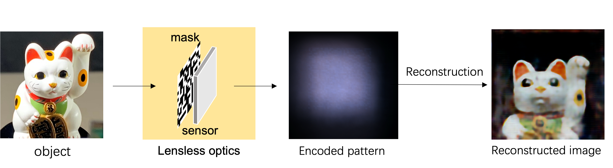
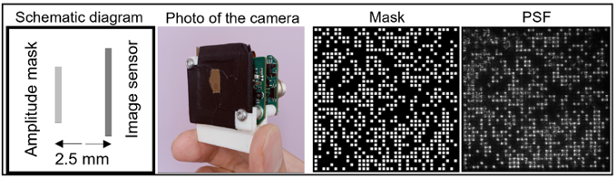

**Title: Image reconstruction with Transformer for mask-based lensless imaging**

**Authors: Xiuxi Pan, Xiao Chen, Saori Takeyama, Masahiro Yamaguchi**

**DOI: https://doi.org/10.1364/OL.455378**

[```ol-47-7-1843.pdf```](./ol-47-7-1843.pdf) is the paper.

**News Reports related to this paper (English & Japanese)**:
[WIRED](https://wired.jp/article/mask-based-lensless-imaging/),
[Nikkei](https://www.nikkei.com/article/DGXZQOUC12CUO0S2A510C2000000/),
[Phys.org](https://phys.org/news/2022-04-lensless-imaging-advanced-machine-image.html),
[EurekAlert!](https://www.eurekalert.org/news-releases/951125),
[Tokyo Tech News](https://www.titech.ac.jp/news/2022/063968), et al.




# DATASET
The datasets are available in [Yamaguchi Lab OneDrive](https://1drv.ms/u/s!AjbGbGU9gDA1gcB9wd16MYOoPicCIw?e=dlsrxx) (*It may be a temporary place, we are trying to seek a permanent place if many people are interested in it.*)

There are three datasets:
1. mirflickr25k
  - encoded pattern: 
    - **mirflickr25k_1600.zip** in the OneDrive
  - original images: 
    - available in this [link](https://www.kaggle.com/datasets/paulrohan2020/mirflickr25k?resource=download)
  - pattern-image matchup: 
    - the corresponding encoded pattern and original image have the same name, only different in file extension. e.g., pattern "im1.npy"<-> image "im1.jpg".
2. dogs-vs-cats
  - encoded pattern: 
    - **PetImages_1600.zip** in the OneDrive
  - original images: 
    - available in this [link](https://www.kaggle.com/competitions/dogs-vs-cats/data), only 25k images in train folder are used.
  - pattern-image matchup: 
    - encoded patterns of dog & cat are separated to different folders. e.g., pattern "Cat/0.npy"<-> image "cat.0.jpg", pattern "Dog/1965.npy"<-> image "dog.1965.jpg"
3. fruits
  - encoded pattern: 
    - **fruits_modified.zip** in the OneDrive
  - original images: 
    - **fruits_modifiedori.zip** in the OneDrive
  - pattern-image matchup: 
    - same name, only different in file extension. e.g., pattern "n07739125_7447.npy"<-> image "n07739125_7447.JPEG".


The data collection method is written in page 3 of the [original paper](https://github.com/BobPXX/Lensless_Imaging_Transformer/blob/main/ol-47-7-1843.pdf). The program to control the sensor for data collection is available in [my another repository](https://github.com/BobPXX/IDS_sensor_control).


# USAGE
## Training
```datasets/prepare_datasets.py``` prepares .npy files of dataset address;

```configs.yaml``` defines training implementations;

```train.py``` stars training.

An example of running ```train.py``` in linux: 
```
CUDA_VISIBLE_DEVICES=0,1 nohup python -m torch.distributed.launch --nproc_per_node=1 --master_port 29501 train.py &
```

## Prediction
```predict.py``` starts prediction.

Checkpoint (```checkpoints/best.pth```) and input patterns (```result/in-wild/pattern/``` and ```result/on-screen/pattern/```) can be used to verify our results.

## Note
```GrayPSF.npy``` is PSF of our lensless camera. It is not used in this reconstruction method, but a useful file to evaluate status of the optical system.

# MESSAGE
I am working in productizing lensless camera. Here are some potential applications:
1. replace traditional camera in scenarios where space, weight or cost are extremely imposed, e.g., 
    - cost-senitive IoT devices, 
    - under-screen camera, 
    - a space that is too limited for placing a traditional camera.
    - ...
2. invisible spectrum (e.g, gama-ray, X-ray) imaging. 
    - (With lens, invisible spectrum imaging is too expensive or impossible for traditional lensed camera)
3. optics-level privacy-preserving and cryptographic imaging/sensing
    - the captured encoded pattern is uninterpretable for human, we are taking this feature to develop privacy pretection and encryption.
    - my another project [reconstruction-free lensless sensing](https://github.com/BobPXX/LLI_Transformer), verified that the directly object recognition on the uninterpretable encoded pattern is possible.

You are warmly welcome to join me for production development or extended research. You are also welcome for any question or discussion. Please contact me through [My LinkedIn homepage](https://www.linkedin.com/in/xiuxi-pan-ph-d-aa8868222/) or email. 
