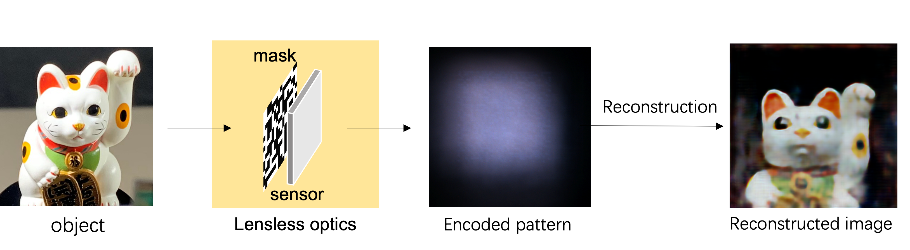
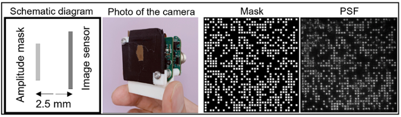

# Image reconstruction with Transformer for mask-based lensless imaging

End-to-end Transformer-based image reconstruction for mask-based lensless cameras — recovers a scene-resembling image directly from the encoded sensor pattern, without classical iterative optimization.

> Xiuxi Pan, Xiao Chen, Saori Takeyama, and Masahiro Yamaguchi.
> "Image reconstruction with transformer for mask-based lensless imaging."
> *Optics Letters* **47**(7), 1843–1846 (2022). [https://doi.org/10.1364/OL.455378](https://doi.org/10.1364/OL.455378)

The paper PDF is included: [`ol-47-7-1843.pdf`](./ol-47-7-1843.pdf).


# In the news

[WIRED](https://wired.jp/article/mask-based-lensless-imaging/),
[Nikkei](https://www.nikkei.com/article/DGXZQOUC12CUO0S2A510C2000000/),
[Phys.org](https://phys.org/news/2022-04-lensless-imaging-advanced-machine-image.html),
[EurekAlert!](https://www.eurekalert.org/news-releases/951125),
[Tokyo Tech News](https://www.titech.ac.jp/news/2022/063968), et al.


# Awards

- [2022年度（令和4年度）手島精一記念研究賞](https://www.titech.ac.jp/news/2023/066259)
- [第38回 (2022年度) 電気通信普及財団賞](https://www.taf.or.jp/files/2061/979456817.pdf)






# Requirements

Reproducible conda environment is provided:

```bash
conda env create -f environment.yml
```


# Usage
## Training
1. `scripts/prepare_dataset.py` writes the filename-list `.npy` files into `datasets/`. Edit `pattern_path` / `ori_path` inside the script first.
2. `configs/default.yaml` defines training settings (edit the paths there too).
3. Launch from repo root:
   ```bash
   CUDA_VISIBLE_DEVICES=0,1 python -m scripts.train
   ```
   The training script uses `DataParallel`, so visible GPUs are picked up automatically.

## Prediction
```bash
python -m scripts.predict \
    --checkpoint checkpoints/best.pth \
    --input-dir results/in-wild/patterns/ \
    --output-dir results/in-wild/reconstructions/
```

The provided checkpoint `checkpoints/best.pth` and the patterns under `results/in-wild/patterns/` and `results/on-screen/patterns/` can be used to reproduce results.


# Dataset
The datasets are available in [Yamaguchi Lab OneDrive](https://1drv.ms/u/s!AjbGbGU9gDA1gcB9wd16MYOoPicCIw?e=dlsrxx) (*It may be a temporary place, we are trying to seek a permanent place if many people are interested in it.*)

There are three datasets:
1. mirflickr25k
   - encoded pattern:
     - **mirflickr25k_1600.zip** in the OneDrive
   - original images:
     - available in this [link](https://www.kaggle.com/datasets/paulrohan2020/mirflickr25k?resource=download)
   - pattern-image matchup:
     - the corresponding encoded pattern and original image have the same name, only different in file extension. e.g., pattern "im1.npy"<-> image "im1.jpg".
2. dogs-vs-cats
   - encoded pattern:
     - **PetImages_1600.zip** in the OneDrive
   - original images:
     - available in this [link](https://www.kaggle.com/competitions/dogs-vs-cats/data), only 25k images in train folder are used.
   - pattern-image matchup:
     - encoded patterns of dog & cat are separated to different folders. e.g., pattern "Cat/0.npy"<-> image "cat.0.jpg", pattern "Dog/1965.npy"<-> image "dog.1965.jpg"
3. fruits
   - encoded pattern:
     - **fruits_modified.zip** in the OneDrive
   - original images:
     - **fruits_modifiedori.zip** in the OneDrive
   - pattern-image matchup:
     - same name, only different in file extension. e.g., pattern "n07739125_7447.npy"<-> image "n07739125_7447.JPEG".

The data collection method is written in page 3 of the [original paper](https://github.com/BobPXX/Lensless_Imaging_Transformer/blob/main/ol-47-7-1843.pdf). The program to control the sensor for data collection is available in [my another repository](https://github.com/BobPXX/IDS_sensor_control).


# Citation

```bibtex
@article{pan2022lensless,
  author  = {Xiuxi Pan and Xiao Chen and Saori Takeyama and Masahiro Yamaguchi},
  title   = {Image reconstruction with transformer for mask-based lensless imaging},
  journal = {Optics Letters},
  volume  = {47},
  number  = {7},
  pages   = {1843--1846},
  year    = {2022},
  doi     = {10.1364/OL.455378}
}
```


# License

MIT — see [LICENSE](./LICENSE).


# Applications & contact

Lensless Camera based on this paper has been productized and commercialized. Here are some potential applications:
1. Replace traditional camera in scenarios where space, weight or cost is extremely imposed, e.g.,
    - cost-sensitive IoT devices,
    - under-screen camera,
    - a space that is too limited for placing a traditional camera.
    - ...
2. Invisible spectrum (e.g, gama-ray, X-ray) imaging
    - Invisible spectrum imaging is too expensive or impossible for traditional lensed camera because of the usage of lens.
3. Optics-level privacy-preserving and cryptographic imaging/sensing
    - The captured encoded pattern is uninterpretable for human. We take this feature to develop privacy pretection and encryption.
    - My another project [reconstruction-free lensless sensing](https://github.com/BobPXX/LLI_Transformer) verified that direct object recognition on the uninterpretable encoded pattern is possible.

You are warmly welcome to join me for further production development or extended research. You are also welcome for any question or discussion. Please contact me through [My LinkedIn homepage](https://www.linkedin.com/in/xiuxi-pan-ph-d-aa8868222/) or email.


# Notes

`GrayPSF.npy` is the PSF of our lensless camera. It is not used in this reconstruction method, but is a useful file to evaluate the status of the optical system.
